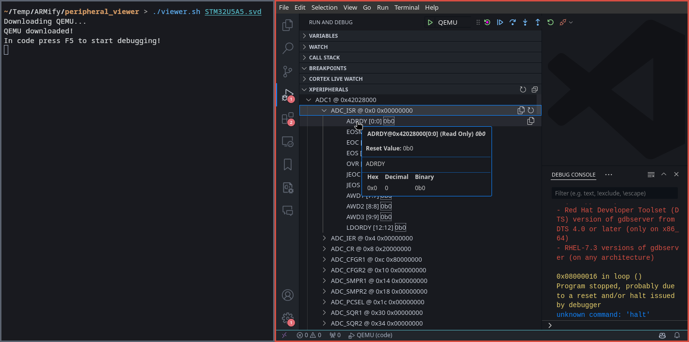

# VS Code SVD Peripheral Viewer

Utilizes [cortex-debug](https://github.com/Marus/cortex-debug) to view arbitrary SVD files independent of the debugged program. The files are processed (derivedFrom, nested clusters, ...) by the cortex-debug plugin.



## Usage

```shell
./viewer.sh <path_to_svd_file>
```

## Why?

During the development of [SVDSuite](https://github.com/ARMify-Project/SVDSuite), the results were compared with other SVD parsers, as the standard is not always clear and sometimes insufficiently documented. The parser from [cortex-debug](https://github.com/Marus/cortex-debug) turned out to be very powerful, as it has more features (e.g. [forward referencing](https://github.com/Open-CMSIS-Pack/devtools/issues/814) for derivedFrom) than ARM's reference parser [svdconv](https://github.com/Open-CMSIS-Pack/cmsis-toolbox).

However, [cortex-debug](https://github.com/Marus/cortex-debug) and it's extracted extension [Peripheral Viewer](https://github.com/mcu-debug/peripheral-viewer) both only show information about SVD files while debugging a program.

The shell script in this repository is a wrapper for cortex-debug. It downloads QEMU, installs the cortex-debug plugin in VS Code and modifies VS Code's `launch.json` for the appropriate SVD path. Afterwards it executes VS Code and QEMU with a dummy binary to allow a debugging session.